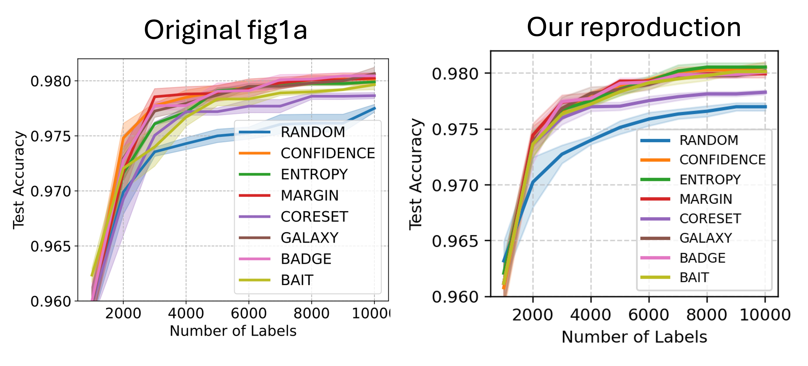

# LabelBench CIFAR-10 Reproduction
[**NDAK24003U Advanced Topics in Deep Learning (ATDL)**](https://kurser.ku.dk/course/ndak24003u) --- Assignment 2

Paper: [LabelBench: A Comprehensive Framework for Benchmarking Adaptive Label-Efficient Learning](https://arxiv.org/abs/2306.09910)

Group 16 contributors: Mingzhe Cai; Shang Xi; Yusheng Lu; Zecheng Zhang;

This repository is trying to reproduce Figures 1(a) and 5(a) from LabelBench. We use CIFAR-10, CLIP ViT-B/32, FlexMatch, and eight active-learning strategies. Larger datasets such as ImageNet experiments are outside our compute budget;

Figure 1(a) cost 8 GPU hours on two NVIDIA A30 GPUs(4 seeds * 8 strategies).

Figure 5(a) selection alone took about 9 GPU hours on two NVIDIA A30 GPUs(4 seeds * 8 strategies * 2 phase).

Our scripts build on the [authors' code](https://github.com/EfficientTraining/LabelBench). The original implementation logs runs to Weights & Biases, this repository stores the results locally in SQLite. Each panel uses four seeds (`1234`, `3334155`, `6667077`, `9999999`) and ten epoch of 1,000 new labels.

## Setup

```bash
# Download the repository
git clone https://github.com/samcaimingzhe/UCPH_ATDL_2026_Group16_Assignment2_LabelBench.git
cd UCPH_ATDL_2026_Group16_Assignment2_LabelBench

# Before training, please create a virtual environment and install the required dependencies
conda create -n labelbench python=3.10.22
conda activate labelbench
python -m pip install -r requirements.txt
```

CIFAR-10 and the pretrained CLIP weights are loaded from `data/` and `model/`; the dataset/model loaders download missing assets when network access is available.

Note that download speed of CIFAR-10 is really slow.

## Run

```bash
# Figure 1(a): full-model selection and evaluation
python scripts/run_fig1a.py --gpus 0 --output-dir results/fig1
python scripts/plot_fig1a.py

# Figure 5(a): proxy selection, then full-model evaluation
python scripts/run_fig5.py --panel a --phase selection --gpus 0 --output results/fig5
python scripts/run_fig5.py --panel a --phase evaluate --gpus 0 --output results/fig5
python scripts/plot_fig5.py --panel a

# Figure 5(b): proxy selection, then full-model evaluation
python scripts/run_fig5.py --panel b --phase selection --gpus 0 --output results/fig5
python scripts/run_fig5.py --panel b --phase evaluate --gpus 0 --output results/fig5
python scripts/plot_fig5.py --panel b

# Figure 5(c): proxy selection, then full-model evaluation
python scripts/run_fig5.py --panel c --phase selection --gpus 0 --output results/fig5
python scripts/run_fig5.py --panel c --phase evaluate --gpus 0 --output results/fig5
python scripts/plot_fig5.py --panel c


# Check the results
python scripts/check_db.py --db results/fig1a/figure1a.sqlite
python scripts/check_db.py --db results/fig5/a/figure5a.sqlite
```
Completed method/seed runs are skipped when restarted with the same output directory. An interrupted run restarts its current method/seed from round 1. Plotting requires all four seeds to finish. Figure 5(a)'s plot uses evaluation metrics, not proxy-selection metrics.

```
python scripts/plot_fig1a.py --input results/fig1a/figure1a.sqlite --output results/plots/
python scripts/plot_fig5.py --input results/fig1a/figure1a.sqlite --output results/plots/
```

## Reproduction result

Figure 1(a) shows a similar trend to the paper: active selection generally outperforms random sampling, and most methods approach 98% test accuracy at 10,000 labels. Small differences remain between the curves.


